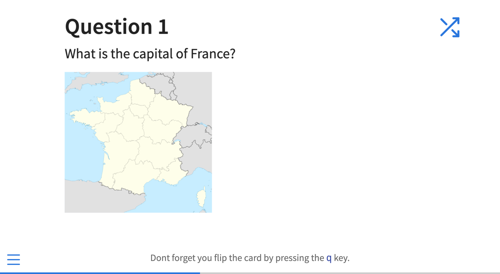
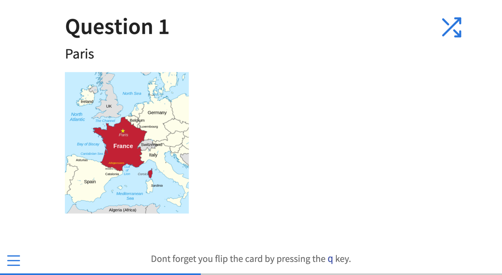

# Flashcards Extension For Quarto

Simple RevealJS that allows you to create flashcards in Quarto.

Here's is an example of what the flashcards look like.

Front of a flashcard:


Back of a flashcard:


## Installing

```bash
quarto add parmsam/quarto-flashcards
```

This will install the extension under the `_extensions` subdirectory.
If you're using version control, you will want to check in this directory.

## Using

Simply add the extension to the list of revealjs plugins like:

``` markdown
title: My Presentation
format:
    revealjs: default
revealjs-plugins:
  - flashcards
```

Then use the following syntax within a slide to create a flashcard.

``` markdown
## Slide title goes here

::: {.flashcard-front}
Front of the flashcard goes here
:::

::: {.flashcard-back}
Back of the flashcard goes here
:::
```

By default, the key to flip the flashcard is 'q'. You can change this by setting the `flipKey` option in your YAML header like:

``` markdown
title: My Presentation
format:
  revealjs:
    flashcards: 
      flipKey: 'r'
      shuffleKey: 't'
      showFlipButton: true
revealjs-plugins:
  - flashcards
```

You'll also notice a `shuffleKey` option. This is a keyboard shortcut that can be used to shuffle the slides and jump to the new first slide. By default, it's set to 't' but you can change it to any key you like.

Lastly, there's a flip button on the top right corner of the slide that can be shown on the flashcard. By default, it's set to `true` but you can change it to `false` to hide the flip buttons.

## Example

Here is the source code for a minimal example: [example.qmd](example.qmd).

The output of `example.qmd` is [here](https://parmsam.github.io/quarto-flashcards/).

